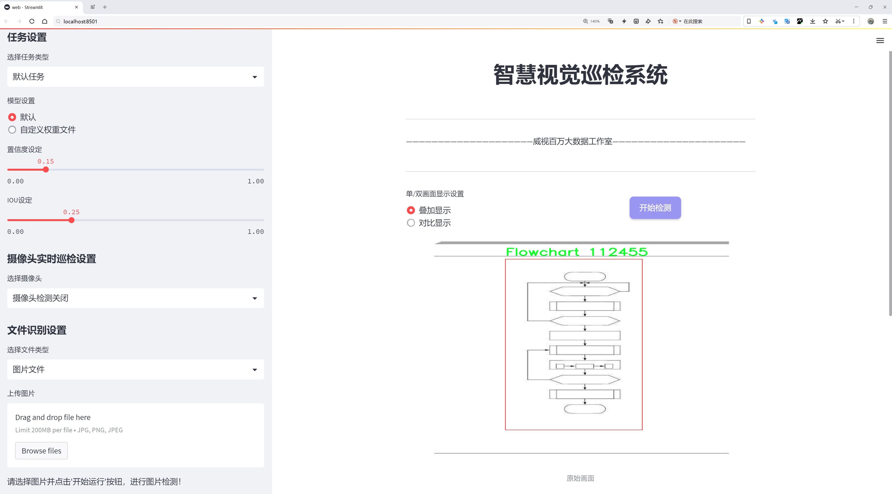
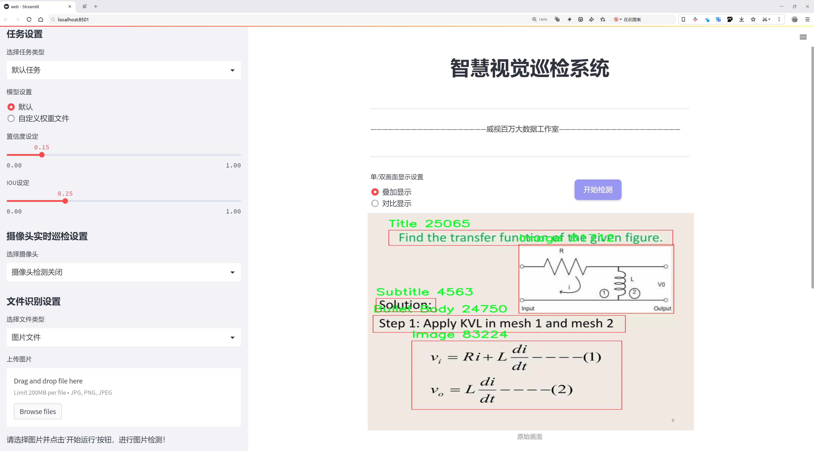
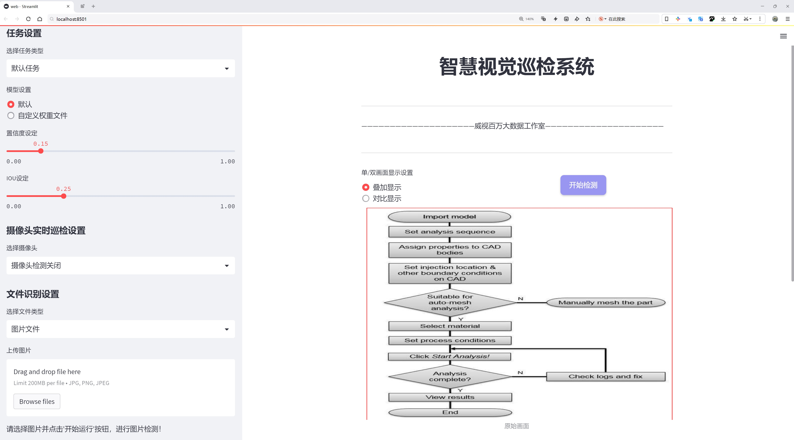
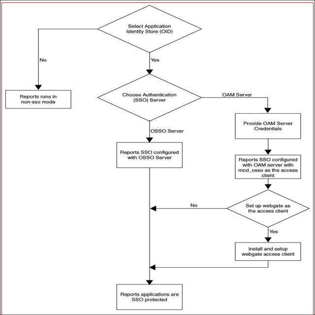
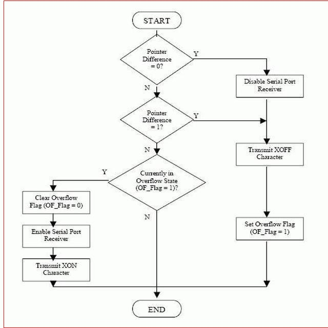
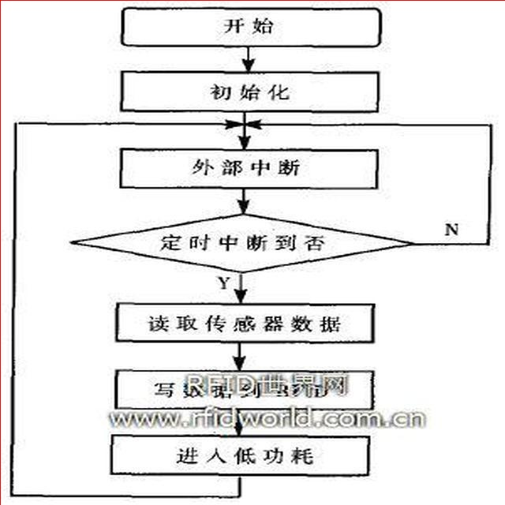
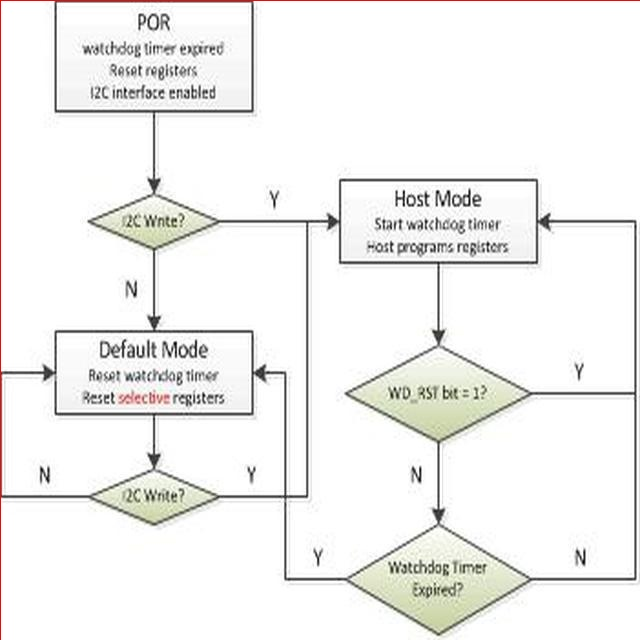
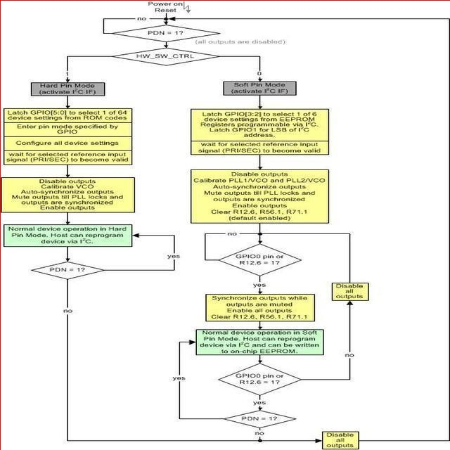

# 文档布局内容检测检测系统源码分享
 # [一条龙教学YOLOV8标注好的数据集一键训练_70+全套改进创新点发刊_Web前端展示]

### 1.研究背景与意义

项目参考[AAAI Association for the Advancement of Artificial Intelligence](https://gitee.com/qunmasj/projects)

项目来源[AACV Association for the Advancement of Computer Vision](https://kdocs.cn/l/cszuIiCKVNis)

研究背景与意义

随着信息技术的迅猛发展，文档的数字化和自动化处理已成为各行业提升工作效率的重要手段。文档布局内容检测系统的研究，旨在通过计算机视觉技术自动识别和解析文档中的各种元素，从而实现对文档内容的智能化管理与处理。近年来，深度学习技术的快速进步为文档布局分析提供了新的机遇，其中基于YOLO（You Only Look Once）系列模型的目标检测方法因其高效性和准确性而备受关注。YOLOv8作为该系列的最新版本，进一步提升了目标检测的速度和精度，为文档布局内容检测提供了强有力的技术支持。

在文档布局分析中，常见的元素包括标题、段落、图像、流程图、脚注等，这些元素的准确识别对于文档的理解和后续处理至关重要。以我们所使用的数据集为例，包含1750张图像，涵盖了9个类别，包括子弹正文、流程图、脚注、图像、标志、段落、子标题、标题及其他对象。这些类别的多样性为模型的训练提供了丰富的样本，有助于提高模型的泛化能力和实用性。

当前，传统的文档处理方法往往依赖于手工设计的特征提取算法，难以适应多样化的文档格式和布局，且处理效率低下。相比之下，基于YOLOv8的改进模型能够通过深度学习自动提取特征，快速准确地识别文档中的各类元素，极大地提升了文档处理的自动化水平。此外，YOLOv8的实时检测能力使得该系统在实际应用中具备了良好的用户体验，能够满足快速处理和高准确率的需求。

在实际应用中，文档布局内容检测系统的研究不仅能够提高文档处理的效率，还能够为信息检索、文档归档、内容分析等领域提供有力支持。通过对文档中各类元素的自动识别与分类，用户可以更方便地进行信息的提取与利用，进而提升决策的效率和准确性。此外，该系统的研究成果也可为相关领域的研究提供借鉴，推动文档智能化处理技术的进一步发展。

综上所述，基于改进YOLOv8的文档布局内容检测系统的研究具有重要的理论意义和广泛的应用前景。通过对文档内容的自动检测与分析，我们不仅能够提升文档处理的效率，还能够为信息化社会的发展贡献力量。未来，随着数据集的不断丰富和模型技术的不断进步，该系统有望在更多实际场景中得到应用，为各行业的数字化转型提供强有力的支持。

### 2.图片演示







##### 注意：由于此博客编辑较早，上面“2.图片演示”和“3.视频演示”展示的系统图片或者视频可能为老版本，新版本在老版本的基础上升级如下：（实际效果以升级的新版本为准）

  （1）适配了YOLOV8的“目标检测”模型和“实例分割”模型，通过加载相应的权重（.pt）文件即可自适应加载模型。

  （2）支持“图片识别”、“视频识别”、“摄像头实时识别”三种识别模式。

  （3）支持“图片识别”、“视频识别”、“摄像头实时识别”三种识别结果保存导出，解决手动导出（容易卡顿出现爆内存）存在的问题，识别完自动保存结果并导出到tempDir中。

  （4）支持Web前端系统中的标题、背景图等自定义修改，后面提供修改教程。

  另外本项目提供训练的数据集和训练教程,暂不提供权重文件（best.pt）,需要您按照教程进行训练后实现图片演示和Web前端界面演示的效果。

### 3.视频演示

[3.1 视频演示](https://www.bilibili.com/video/BV1GYtUeXEcC/)

### 4.数据集信息展示

##### 4.1 本项目数据集详细数据（类别数＆类别名）

nc: 8
names: ['Bullet Body', 'Flowchart', 'Footer', 'Image', 'Logo', 'Paragraph', 'Subtitle', 'Title']


##### 4.2 本项目数据集信息介绍

数据集信息展示

在现代文档处理与分析领域，文档布局内容检测系统的有效性依赖于高质量的数据集。为此，我们构建了一个名为“object detection and prediction”的数据集，旨在为改进YOLOv8模型提供强有力的支持。该数据集专注于文档中的特定元素，涵盖了八个类别，分别是：Bullet Body、Flowchart、Footer、Image、Logo、Paragraph、Subtitle和Title。这些类别的选择不仅反映了文档布局的多样性，也为模型的训练提供了丰富的样本，帮助其更好地理解和识别文档中的不同组成部分。

在数据集的构建过程中，我们精心挑选了各种类型的文档，确保每个类别都有足够的样本量，以便模型能够学习到每种元素的特征。例如，Bullet Body类别包括了各种形式的项目符号列表，这在技术文档和报告中非常常见；Flowchart类别则包含了多种流程图的示例，帮助模型识别复杂的逻辑关系；Footer类别则集中在文档底部的附加信息，如页码和版权声明；而Image类别则涵盖了各种图像，确保模型能够识别并处理图像内容。

此外，Logo类别的样本展示了品牌标识的多样性，能够帮助模型学习到不同的图形特征和颜色组合。Paragraph类别则包含了不同格式的段落文本，模型需要能够处理不同的文本排版和样式；Subtitle和Title类别则帮助模型识别文档中的标题和副标题，这对于理解文档结构至关重要。

为了确保数据集的多样性和代表性，我们在收集样本时考虑了不同的文档类型，包括学术论文、商业报告、宣传册和用户手册等。这种多样性不仅增强了数据集的适用性，也为模型的泛化能力提供了保障。每个类别的样本都经过精心标注，确保每个元素的边界框准确无误，这对于训练YOLOv8模型至关重要。

在数据集的使用过程中，研究人员和开发者可以利用这些标注数据进行模型训练和评估，进而提高文档布局内容检测的准确性和效率。通过不断迭代和优化模型，最终目标是实现对文档内容的智能分析，帮助用户快速提取和理解关键信息。

总之，“object detection and prediction”数据集不仅为YOLOv8模型的训练提供了坚实的基础，也为文档处理领域的研究与应用开辟了新的可能性。随着数据集的不断扩展和更新，我们期待看到更多创新的应用场景，推动文档智能化处理的进程。











### 5.全套项目环境部署视频教程（零基础手把手教学）

[5.1 环境部署教程链接（零基础手把手教学）](https://www.ixigua.com/7404473917358506534?logTag=c807d0cbc21c0ef59de5)


[5.2 安装Python虚拟环境创建和依赖库安装视频教程链接（零基础手把手教学）](https://www.ixigua.com/7404474678003106304?logTag=1f1041108cd1f708b01a)

### 6.手把手YOLOV8训练视频教程（零基础小白有手就能学会）

[6.1 手把手YOLOV8训练视频教程（零基础小白有手就能学会）](https://www.ixigua.com/7404477157818401292?logTag=d31a2dfd1983c9668658)

### 7.70+种全套YOLOV8创新点代码加载调参视频教程（一键加载写好的改进模型的配置文件）

[7.1 70+种全套YOLOV8创新点代码加载调参视频教程（一键加载写好的改进模型的配置文件）](https://www.ixigua.com/7404478314661806627?logTag=29066f8288e3f4eea3a4)

### 8.70+种全套YOLOV8创新点原理讲解（非科班也可以轻松写刊发刊，V10版本正在科研待更新）

由于篇幅限制，每个创新点的具体原理讲解就不一一展开，具体见下列网址中的创新点对应子项目的技术原理博客网址【Blog】：


[8.1 70+种全套YOLOV8创新点原理讲解链接](https://gitee.com/qunmasj/good)

### 9.系统功能展示（检测对象为举例，实际内容以本项目数据集为准）

图9.1.系统支持检测结果表格显示

  图9.2.系统支持置信度和IOU阈值手动调节

  图9.3.系统支持自定义加载权重文件best.pt(需要你通过步骤5中训练获得)

  图9.4.系统支持摄像头实时识别

  图9.5.系统支持图片识别

  图9.6.系统支持视频识别

  图9.7.系统支持识别结果文件自动保存

  图9.8.系统支持Excel导出检测结果数据


### 10.原始YOLOV8算法原理

原始YOLOv8算法原理

YOLOv8算法是目标检测领域的一项重要进展，继承了YOLO系列算法的优良传统，并在此基础上进行了多方面的优化和改进。作为一种单阶段检测算法，YOLOv8在检测精度和速度上都表现出了显著的优势，适应了现代计算机视觉任务的需求。其核心思想是通过高效的特征提取和融合策略，快速而准确地识别和定位图像中的目标。

YOLOv8的网络结构主要由四个部分组成：输入模块、Backbone骨干网络、Neck特征融合网络和Head检测模块。输入模块负责对输入图像进行预处理，包括调整图像比例、实现Mosaic增强和瞄点计算等。这些预处理步骤不仅提高了数据的多样性，还增强了模型的鲁棒性，使其能够在不同的环境和条件下进行有效的目标检测。

在Backbone骨干网络中，YOLOv8沿用了DarkNet结构，但进行了重要的改进。YOLOv8用C2f模块替换了YOLOv5中的C3模块，C2f模块通过引入更多的分支来丰富梯度流动信息，从而提高了特征提取的能力。这种设计不仅保留了轻量级特性，还在不同尺度模型中调整了通道数，以适应不同的检测任务。通过这种方式，YOLOv8能够更好地捕捉到图像中的细节特征，提升了目标检测的精度。

在特征融合方面，YOLOv8采用了FPN（特征金字塔网络）和PAN（路径聚合网络）的双塔结构，进一步促进了语义特征和定位特征之间的转移。这种结构的设计使得YOLOv8能够在多尺度信息之间进行充分的融合，从而增强了对不同尺度目标的检测性能。通过对特征图的处理，YOLOv8能够有效地整合来自不同层次的信息，确保在检测过程中不会丢失重要的上下文信息。

YOLOv8的Head检测模块采用了解耦头的结构，将回归分支和预测分支进行分离。这种设计使得模型在进行目标检测时能够更加高效，减少了训练和推理过程中的计算复杂度。解耦头的引入，使得YOLOv8能够独立地处理分类和定位任务，从而加速了模型的收敛，提高了检测的准确性。

在损失函数的设计上，YOLOv8引入了新的损失策略，通过变焦损失计算分类损失，并使用数据平均保真度损失和完美交并比损失对边界框损失进行计算。这种策略使得YOLOv8在处理目标检测任务时，能够更加准确地进行目标定位和分类。与以往的YOLO版本相比，YOLOv8在标签分配策略上也进行了创新，采用了动态标签分配策略，以更好地适应不同数据集的特征。这种策略的引入，解决了传统方法中候选框聚类依赖于数据集的问题，使得YOLOv8在各种场景下都能保持良好的性能。

YOLOv8的设计理念不仅关注于模型的复杂度和计算效率，还强调了模型的可扩展性和适应性。通过对网络结构的优化和损失函数的改进，YOLOv8能够在高效的基础上，实现准确的目标检测。这种设计使得YOLOv8在实际应用中表现出色，能够满足各种计算机视觉任务的需求。

综上所述，YOLOv8算法在原有YOLO系列的基础上，通过引入新的网络结构、优化特征提取和融合策略、改进损失函数等多方面的创新，提升了目标检测的精度和速度。其独特的设计使得YOLOv8在面对复杂的视觉任务时，能够有效地捕捉到目标特征，快速而准确地进行目标检测。这些优点使得YOLOv8成为当前目标检测领域中最为先进的算法之一，广泛应用于自动驾驶、安防监控、智能制造等多个领域，展现出广阔的应用前景。


### 11.项目核心源码讲解（再也不用担心看不懂代码逻辑）

#### 11.1 code\ultralytics\trackers\bot_sort.py

以下是经过精简和注释的核心代码部分，保留了最重要的功能和逻辑：

```python
# Ultralytics YOLO 🚀, AGPL-3.0 license

from collections import deque
import numpy as np
from .basetrack import TrackState
from .byte_tracker import BYTETracker
from .utils import matching
from .utils.gmc import GMC
from .utils.kalman_filter import KalmanFilterXYWH

class BOTrack:
    """
    BOTrack类用于YOLOv8的对象跟踪，扩展了STrack类，增加了特征平滑和卡尔曼滤波功能。
    """

    shared_kalman = KalmanFilterXYWH()  # 共享的卡尔曼滤波器实例

    def __init__(self, tlwh, score, cls, feat=None, feat_history=50):
        """初始化BOTrack实例，设置边界框、分数、类别和特征历史长度。"""
        self.tlwh = tlwh  # 边界框信息
        self.score = score  # 置信度分数
        self.cls = cls  # 类别
        self.smooth_feat = None  # 平滑特征
        self.curr_feat = None  # 当前特征
        self.features = deque([], maxlen=feat_history)  # 特征历史
        self.alpha = 0.9  # 平滑因子

        if feat is not None:
            self.update_features(feat)  # 更新特征

    def update_features(self, feat):
        """更新特征向量并使用指数移动平均进行平滑处理。"""
        feat /= np.linalg.norm(feat)  # 归一化特征
        self.curr_feat = feat  # 当前特征
        if self.smooth_feat is None:
            self.smooth_feat = feat  # 初始化平滑特征
        else:
            # 更新平滑特征
            self.smooth_feat = self.alpha * self.smooth_feat + (1 - self.alpha) * feat
        self.features.append(feat)  # 添加当前特征到历史特征
        self.smooth_feat /= np.linalg.norm(self.smooth_feat)  # 归一化平滑特征

    def predict(self):
        """使用卡尔曼滤波器预测状态的均值和协方差。"""
        mean_state = self.mean.copy()  # 复制当前均值状态
        if self.state != TrackState.Tracked:
            mean_state[6] = 0  # 状态未跟踪时，速度设为0
            mean_state[7] = 0

        # 预测均值和协方差
        self.mean, self.covariance = self.shared_kalman.predict(mean_state, self.covariance)

    @property
    def tlwh(self):
        """获取当前边界框位置，格式为 (左上角x, 左上角y, 宽度, 高度)。"""
        if self.mean is None:
            return self.tlwh.copy()  # 返回初始边界框
        ret = self.mean[:4].copy()  # 复制均值的前四个元素
        ret[:2] -= ret[2:] / 2  # 计算左上角坐标
        return ret

class BOTSORT(BYTETracker):
    """
    BOTSORT类用于YOLOv8的对象跟踪，结合了ReID和GMC算法。
    """

    def __init__(self, args, frame_rate=30):
        """初始化BOTSORT实例，设置跟踪参数和GMC算法。"""
        super().__init__(args, frame_rate)
        self.proximity_thresh = args.proximity_thresh  # 空间接近阈值
        self.appearance_thresh = args.appearance_thresh  # 外观相似性阈值
        self.gmc = GMC(method=args.gmc_method)  # GMC实例

    def init_track(self, dets, scores, cls, img=None):
        """使用检测结果初始化跟踪。"""
        if len(dets) == 0:
            return []
        return [BOTrack(xyxy, s, c) for (xyxy, s, c) in zip(dets, scores, cls)]  # 返回BOTrack实例列表

    def get_dists(self, tracks, detections):
        """计算跟踪和检测之间的距离。"""
        dists = matching.iou_distance(tracks, detections)  # 计算IoU距离
        # 进一步处理距离
        return dists

    def multi_predict(self, tracks):
        """预测和跟踪多个对象。"""
        BOTrack.shared_kalman.multi_predict(tracks)  # 调用共享卡尔曼滤波器进行预测
```

### 代码说明：
1. **BOTrack类**：用于实现YOLOv8的对象跟踪，利用卡尔曼滤波器进行状态预测，并使用特征平滑技术提高跟踪的稳定性。
   - `update_features`方法用于更新特征并进行平滑处理。
   - `predict`方法使用卡尔曼滤波器预测对象的状态。
   - `tlwh`属性用于获取当前对象的边界框信息。

2. **BOTSORT类**：继承自BYTETracker，专门为YOLOv8设计，结合了ReID和GMC算法。
   - `init_track`方法用于初始化跟踪对象。
   - `get_dists`方法计算跟踪和检测之间的距离，使用IoU进行评估。

以上代码实现了YOLOv8中的对象跟踪功能，结合了特征处理和卡尔曼滤波，适用于动态场景中的目标检测与跟踪。

该文件实现了一个基于YOLOv8的对象跟踪系统，主要包含两个类：`BOTrack`和`BOTSORT`。`BOTrack`类是对YOLOv8中`STrack`类的扩展，增加了对象跟踪的功能，而`BOTSORT`类则是对`BYTETracker`类的扩展，旨在结合ReID（重识别）和GMC（图形匹配算法）进行对象跟踪。

在`BOTrack`类中，首先定义了一些属性，包括共享的卡尔曼滤波器、平滑特征向量、当前特征向量、特征历史记录等。该类的构造函数初始化了这些属性，并且在提供特征时会调用`update_features`方法来更新和光滑特征向量。`update_features`方法通过指数移动平均来平滑特征，并将其存储在一个双端队列中。

`predict`方法使用卡尔曼滤波器预测当前对象的状态，包括均值和协方差。如果对象的状态不是“被跟踪”，则将均值的速度分量设为零。`re_activate`和`update`方法用于重新激活和更新跟踪对象的状态，并在此过程中更新特征。`tlwh`属性返回当前对象的位置，以左上角坐标和宽高的格式表示。`multi_predict`方法则可以同时预测多个对象的状态，利用共享的卡尔曼滤波器来提高效率。

`BOTSORT`类则主要负责初始化跟踪器并处理检测到的对象。构造函数中设置了与ReID相关的阈值，并初始化了GMC算法的实例。`get_kalmanfilter`方法返回一个新的卡尔曼滤波器实例。`init_track`方法用于根据检测结果、分数和类别初始化跟踪对象。如果启用了ReID模块，则会使用编码器提取特征。`get_dists`方法计算跟踪对象与检测对象之间的距离，使用IoU（交并比）和可选的ReID嵌入来进行匹配。最后，`multi_predict`方法调用`BOTrack`的`multi_predict`方法来处理多个对象的预测。

总体而言，该文件实现了一个结合了卡尔曼滤波、ReID和GMC算法的高效对象跟踪系统，适用于YOLOv8模型的应用场景。

#### 11.2 ui.py

```python
import sys
import subprocess

def run_script(script_path):
    """
    使用当前 Python 环境运行指定的脚本。

    Args:
        script_path (str): 要运行的脚本路径

    Returns:
        None
    """
    # 获取当前 Python 解释器的路径
    python_path = sys.executable

    # 构建运行命令
    command = f'"{python_path}" -m streamlit run "{script_path}"'

    # 执行命令
    result = subprocess.run(command, shell=True)
    if result.returncode != 0:
        print("脚本运行出错。")


# 实例化并运行应用
if __name__ == "__main__":
    # 指定您的脚本路径
    script_path = "web.py"  # 这里可以直接指定脚本名称

    # 运行脚本
    run_script(script_path)
```

### 代码注释说明：

1. **导入模块**：
   - `import sys`：导入 sys 模块，以便获取当前 Python 解释器的路径。
   - `import subprocess`：导入 subprocess 模块，用于在 Python 中执行外部命令。

2. **定义函数 `run_script`**：
   - 该函数接受一个参数 `script_path`，表示要运行的 Python 脚本的路径。
   - 函数内部首先获取当前 Python 解释器的路径，存储在 `python_path` 变量中。
   - 然后构建一个命令字符串 `command`，该命令用于运行指定的脚本，使用 `streamlit` 模块。
   - 使用 `subprocess.run` 方法执行命令。如果返回码不为 0，表示脚本运行出错，打印错误信息。

3. **主程序入口**：
   - `if __name__ == "__main__":`：确保该代码块仅在脚本作为主程序运行时执行。
   - 指定要运行的脚本路径为 `web.py`。
   - 调用 `run_script` 函数，传入脚本路径以执行该脚本。

这个程序文件名为 `ui.py`，其主要功能是使用当前的 Python 环境来运行一个指定的脚本，具体是一个名为 `web.py` 的文件。程序首先导入了必要的模块，包括 `sys`、`os` 和 `subprocess`，这些模块提供了与系统交互的功能。

在 `run_script` 函数中，首先定义了一个参数 `script_path`，用于接收要运行的脚本的路径。函数内部通过 `sys.executable` 获取当前 Python 解释器的路径，这样可以确保使用的是当前环境的 Python 版本。接着，构建了一个命令字符串，命令中使用了 `streamlit` 这个库来运行指定的脚本。这里的命令格式为 `"{python_path}" -m streamlit run "{script_path}"`，其中 `{python_path}` 和 `{script_path}` 分别被替换为实际的 Python 解释器路径和脚本路径。

然后，使用 `subprocess.run` 方法执行构建好的命令，`shell=True` 参数允许在 shell 中执行该命令。执行后，程序会检查返回的结果码，如果结果码不为 0，表示脚本运行过程中出现了错误，此时会打印出“脚本运行出错。”的提示信息。

在文件的最后部分，使用 `if __name__ == "__main__":` 来判断当前模块是否是主程序，如果是，则会指定要运行的脚本路径为 `web.py`，并调用 `run_script` 函数来执行这个脚本。这里的 `abs_path` 函数用于获取 `web.py` 的绝对路径，确保在任何工作目录下都能正确找到该脚本。

总的来说，这个程序的核心功能是方便地在当前 Python 环境中运行一个 Streamlit 应用脚本，并处理可能出现的错误。

#### 11.3 70+种YOLOv8算法改进源码大全和调试加载训练教程（非必要）\ultralytics\utils\errors.py

```python
# 导入ultralytics.utils模块中的emojis函数，用于处理带有表情符号的消息
from ultralytics.utils import emojis

# 自定义异常类，用于处理与Ultralytics YOLO模型获取相关的错误
class HUBModelError(Exception):
    """
    自定义异常类，用于处理与模型获取相关的错误。

    当请求的模型未找到或无法检索时，将引发此异常。
    消息经过处理，以包含表情符号，从而提升用户体验。

    属性:
        message (str): 当异常被引发时显示的错误消息。

    注意:
        消息会通过'ultralytics.utils'包中的'emojis'函数自动处理。
    """

    def __init__(self, message='Model not found. Please check model URL and try again.'):
        """创建一个模型未找到的异常。"""
        # 调用父类的构造函数，并使用emojis函数处理消息
        super().__init__(emojis(message))
``` 

### 代码核心部分及注释说明：
1. **导入模块**：引入`emojis`函数，用于在异常消息中添加表情符号，增强用户体验。
2. **自定义异常类**：`HUBModelError`类继承自`Exception`，用于专门处理模型获取失败的情况。
3. **构造函数**：`__init__`方法接受一个可选的消息参数，默认消息指示模型未找到，并调用父类构造函数来初始化异常，同时使用`emojis`函数处理消息。

这个程序文件是Ultralytics YOLO框架中的一个错误处理模块，主要用于定义一个自定义异常类`HUBModelError`。该类专门处理与模型获取相关的错误，比如当请求的模型未找到或无法被检索时，就会抛出这个异常。

在类的文档字符串中，详细说明了这个异常的用途和功能。`HUBModelError`类继承自Python的内置`Exception`类，允许用户在发生特定错误时抛出这个异常。它的构造函数接受一个可选的参数`message`，默认信息为“模型未找到。请检查模型URL并重试。”当这个异常被抛出时，用户将看到这个信息。

值得注意的是，传入的错误信息会通过`ultralytics.utils`包中的`emojis`函数进行处理，这意味着在显示错误信息时，可能会包含一些表情符号，以增强用户体验。这种设计使得错误信息更加友好和易于理解。

总的来说，这个文件的主要功能是提供一个清晰且用户友好的方式来处理模型获取过程中可能出现的错误，从而提升开发者在使用YOLO框架时的体验。

#### 11.4 train.py

以下是代码中最核心的部分，并附上详细的中文注释：

```python
class DetectionTrainer(BaseTrainer):
    """
    DetectionTrainer类用于基于检测模型进行训练，继承自BaseTrainer类。
    """

    def build_dataset(self, img_path, mode="train", batch=None):
        """
        构建YOLO数据集。

        参数:
            img_path (str): 包含图像的文件夹路径。
            mode (str): 模式，可以是'train'或'val'，用户可以为每种模式自定义不同的增强。
            batch (int, optional): 批次大小，仅用于'rect'模式。默认为None。
        """
        gs = max(int(de_parallel(self.model).stride.max() if self.model else 0), 32)
        return build_yolo_dataset(self.args, img_path, batch, self.data, mode=mode, rect=mode == "val", stride=gs)

    def get_dataloader(self, dataset_path, batch_size=16, rank=0, mode="train"):
        """构造并返回数据加载器。"""
        assert mode in ["train", "val"]  # 确保模式是'train'或'val'
        with torch_distributed_zero_first(rank):  # 仅在DDP中初始化数据集*.cache一次
            dataset = self.build_dataset(dataset_path, mode, batch_size)  # 构建数据集
        shuffle = mode == "train"  # 训练模式下打乱数据
        if getattr(dataset, "rect", False) and shuffle:
            LOGGER.warning("WARNING ⚠️ 'rect=True'与DataLoader的shuffle不兼容，设置shuffle=False")
            shuffle = False
        workers = self.args.workers if mode == "train" else self.args.workers * 2  # 设置工作线程数
        return build_dataloader(dataset, batch_size, workers, shuffle, rank)  # 返回数据加载器

    def preprocess_batch(self, batch):
        """对一批图像进行预处理，包括缩放和转换为浮点数。"""
        batch["img"] = batch["img"].to(self.device, non_blocking=True).float() / 255  # 将图像转换为浮点数并归一化
        if self.args.multi_scale:  # 如果启用多尺度
            imgs = batch["img"]
            sz = (
                random.randrange(self.args.imgsz * 0.5, self.args.imgsz * 1.5 + self.stride)
                // self.stride
                * self.stride
            )  # 随机选择新的尺寸
            sf = sz / max(imgs.shape[2:])  # 计算缩放因子
            if sf != 1:  # 如果缩放因子不为1
                ns = [
                    math.ceil(x * sf / self.stride) * self.stride for x in imgs.shape[2:]
                ]  # 计算新的形状
                imgs = nn.functional.interpolate(imgs, size=ns, mode="bilinear", align_corners=False)  # 进行插值
            batch["img"] = imgs  # 更新批次图像
        return batch

    def set_model_attributes(self):
        """设置模型的属性，包括类别数量和名称。"""
        self.model.nc = self.data["nc"]  # 将类别数量附加到模型
        self.model.names = self.data["names"]  # 将类别名称附加到模型
        self.model.args = self.args  # 将超参数附加到模型

    def get_model(self, cfg=None, weights=None, verbose=True):
        """返回YOLO检测模型。"""
        model = DetectionModel(cfg, nc=self.data["nc"], verbose=verbose and RANK == -1)  # 创建检测模型
        if weights:
            model.load(weights)  # 加载权重
        return model

    def get_validator(self):
        """返回YOLO模型验证器。"""
        self.loss_names = "box_loss", "cls_loss", "dfl_loss"  # 定义损失名称
        return yolo.detect.DetectionValidator(
            self.test_loader, save_dir=self.save_dir, args=copy(self.args), _callbacks=self.callbacks
        )

    def label_loss_items(self, loss_items=None, prefix="train"):
        """
        返回带标签的训练损失项字典。

        对于分类不需要，但对于分割和检测是必要的。
        """
        keys = [f"{prefix}/{x}" for x in self.loss_names]  # 创建损失项的键
        if loss_items is not None:
            loss_items = [round(float(x), 5) for x in loss_items]  # 将张量转换为保留5位小数的浮点数
            return dict(zip(keys, loss_items))  # 返回损失项字典
        else:
            return keys  # 返回键列表

    def progress_string(self):
        """返回格式化的训练进度字符串，包括epoch、GPU内存、损失、实例和大小。"""
        return ("\n" + "%11s" * (4 + len(self.loss_names))) % (
            "Epoch",
            "GPU_mem",
            *self.loss_names,
            "Instances",
            "Size",
        )

    def plot_training_samples(self, batch, ni):
        """绘制带有注释的训练样本。"""
        plot_images(
            images=batch["img"],
            batch_idx=batch["batch_idx"],
            cls=batch["cls"].squeeze(-1),
            bboxes=batch["bboxes"],
            paths=batch["im_file"],
            fname=self.save_dir / f"train_batch{ni}.jpg",
            on_plot=self.on_plot,
        )

    def plot_metrics(self):
        """从CSV文件中绘制指标。"""
        plot_results(file=self.csv, on_plot=self.on_plot)  # 保存结果图像

    def plot_training_labels(self):
        """创建YOLO模型的标记训练图。"""
        boxes = np.concatenate([lb["bboxes"] for lb in self.train_loader.dataset.labels], 0)  # 合并所有边界框
        cls = np.concatenate([lb["cls"] for lb in self.train_loader.dataset.labels], 0)  # 合并所有类别
        plot_labels(boxes, cls.squeeze(), names=self.data["names"], save_dir=self.save_dir, on_plot=self.on_plot)  # 绘制标签
```

以上代码主要实现了YOLO检测模型的训练过程，包括数据集的构建、数据加载器的创建、图像的预处理、模型属性的设置、模型的获取、损失的计算和可视化等功能。每个方法都有详细的中文注释，帮助理解其功能和实现细节。

这个程序文件 `train.py` 是一个用于训练 YOLO（You Only Look Once）目标检测模型的 Python 脚本，继承自 `BaseTrainer` 类。该文件包含多个方法，主要用于构建数据集、加载数据、预处理图像、设置模型属性、获取模型、验证模型、记录损失、绘制训练样本和绘制训练指标等。

首先，`DetectionTrainer` 类的构造函数通过传入的参数初始化训练器，并提供了一个示例用法，展示如何创建一个训练器实例并开始训练。类中的 `build_dataset` 方法用于构建 YOLO 数据集，接收图像路径、模式（训练或验证）和批次大小作为参数。它会根据模型的步幅计算出合适的大小，并调用 `build_yolo_dataset` 函数来创建数据集。

`get_dataloader` 方法则负责构建和返回数据加载器，确保在分布式训练中只初始化一次数据集，并根据模式设置是否打乱数据。该方法还会根据模式选择合适的工作线程数。

在 `preprocess_batch` 方法中，程序对图像批次进行预处理，包括将图像缩放到适当的大小并转换为浮点数格式。它还支持多尺度训练，通过随机选择图像大小来增强模型的鲁棒性。

`set_model_attributes` 方法用于设置模型的属性，包括类别数量和类别名称。`get_model` 方法则返回一个 YOLO 检测模型，并可选择加载预训练权重。

`get_validator` 方法返回一个用于验证模型的 `DetectionValidator` 实例，负责计算损失并评估模型性能。`label_loss_items` 方法用于返回带标签的训练损失字典，便于后续的监控和分析。

`progress_string` 方法返回一个格式化的字符串，显示训练进度，包括当前的 epoch、GPU 内存使用情况、损失值、实例数量和图像大小等信息。

`plot_training_samples` 方法用于绘制训练样本及其标注，便于可视化训练过程中的样本情况。最后，`plot_metrics` 和 `plot_training_labels` 方法分别用于绘制训练过程中的指标和标签，帮助用户分析模型的训练效果。

整体来看，这个文件提供了一个完整的框架，用于训练 YOLO 模型，涵盖了数据处理、模型训练、验证和结果可视化等多个方面，便于用户进行目标检测任务的实现和优化。

#### 11.5 70+种YOLOv8算法改进源码大全和调试加载训练教程（非必要）\ultralytics\utils\tal.py

以下是代码中最核心的部分，并附上详细的中文注释：

```python
import torch
import torch.nn as nn

def select_candidates_in_gts(xy_centers, gt_bboxes, eps=1e-9):
    """
    选择在真实框（gt）中的正锚点中心。

    参数:
        xy_centers (Tensor): 形状为(h*w, 2)的张量，表示锚点的中心坐标。
        gt_bboxes (Tensor): 形状为(b, n_boxes, 4)的张量，表示真实框的坐标。

    返回:
        (Tensor): 形状为(b, n_boxes, h*w)的张量，表示每个真实框中锚点的选择情况。
    """
    n_anchors = xy_centers.shape[0]  # 锚点数量
    bs, n_boxes, _ = gt_bboxes.shape  # 批次大小和真实框数量
    lt, rb = gt_bboxes.view(-1, 1, 4).chunk(2, 2)  # 分别获取真实框的左上角和右下角坐标
    bbox_deltas = torch.cat((xy_centers[None] - lt, rb - xy_centers[None]), dim=2).view(bs, n_boxes, n_anchors, -1)
    return bbox_deltas.amin(3).gt_(eps)  # 返回每个锚点是否在真实框内的布尔值

class TaskAlignedAssigner(nn.Module):
    """
    任务对齐分配器，用于目标检测。

    该类根据任务对齐指标将真实对象分配给锚点，该指标结合了分类和定位信息。

    属性:
        topk (int): 考虑的最佳候选数量。
        num_classes (int): 目标类别数量。
        alpha (float): 分类组件的alpha参数。
        beta (float): 定位组件的beta参数。
        eps (float): 防止除以零的小值。
    """

    def __init__(self, topk=13, num_classes=80, alpha=1.0, beta=6.0, eps=1e-9):
        """初始化任务对齐分配器对象，允许自定义超参数。"""
        super().__init__()
        self.topk = topk  # 设置考虑的最佳候选数量
        self.num_classes = num_classes  # 设置目标类别数量
        self.bg_idx = num_classes  # 背景类别索引
        self.alpha = alpha  # 分类指标的权重
        self.beta = beta  # 定位指标的权重
        self.eps = eps  # 防止除以零的小值

    @torch.no_grad()
    def forward(self, pd_scores, pd_bboxes, anc_points, gt_labels, gt_bboxes, mask_gt):
        """
        计算任务对齐分配。

        参数:
            pd_scores (Tensor): 形状为(bs, num_total_anchors, num_classes)的张量，表示锚点的预测分数。
            pd_bboxes (Tensor): 形状为(bs, num_total_anchors, 4)的张量，表示锚点的预测边界框。
            anc_points (Tensor): 形状为(num_total_anchors, 2)的张量，表示锚点的坐标。
            gt_labels (Tensor): 形状为(bs, n_max_boxes, 1)的张量，表示真实框的标签。
            gt_bboxes (Tensor): 形状为(bs, n_max_boxes, 4)的张量，表示真实框的坐标。
            mask_gt (Tensor): 形状为(bs, n_max_boxes, 1)的张量，表示真实框的掩码。

        返回:
            target_labels (Tensor): 形状为(bs, num_total_anchors)的张量，包含正锚点的目标标签。
            target_bboxes (Tensor): 形状为(bs, num_total_anchors, 4)的张量，包含正锚点的目标边界框。
            target_scores (Tensor): 形状为(bs, num_total_anchors, num_classes)的张量，包含正锚点的目标分数。
            fg_mask (Tensor): 形状为(bs, num_total_anchors)的布尔张量，表示正锚点。
            target_gt_idx (Tensor): 形状为(bs, num_total_anchors)的张量，表示正锚点对应的真实框索引。
        """
        self.bs = pd_scores.size(0)  # 批次大小
        self.n_max_boxes = gt_bboxes.size(1)  # 最大真实框数量

        if self.n_max_boxes == 0:  # 如果没有真实框
            device = gt_bboxes.device
            return (torch.full_like(pd_scores[..., 0], self.bg_idx).to(device), 
                    torch.zeros_like(pd_bboxes).to(device),
                    torch.zeros_like(pd_scores).to(device), 
                    torch.zeros_like(pd_scores[..., 0]).to(device),
                    torch.zeros_like(pd_scores[..., 0]).to(device))

        mask_pos, align_metric, overlaps = self.get_pos_mask(pd_scores, pd_bboxes, gt_labels, gt_bboxes, anc_points, mask_gt)

        target_gt_idx, fg_mask, mask_pos = select_highest_overlaps(mask_pos, overlaps, self.n_max_boxes)

        # 分配目标
        target_labels, target_bboxes, target_scores = self.get_targets(gt_labels, gt_bboxes, target_gt_idx, fg_mask)

        # 归一化
        align_metric *= mask_pos
        pos_align_metrics = align_metric.amax(dim=-1, keepdim=True)  # 计算正样本的对齐指标
        pos_overlaps = (overlaps * mask_pos).amax(dim=-1, keepdim=True)  # 计算正样本的重叠
        norm_align_metric = (align_metric * pos_overlaps / (pos_align_metrics + self.eps)).amax(-2).unsqueeze(-1)
        target_scores = target_scores * norm_align_metric  # 更新目标分数

        return target_labels, target_bboxes, target_scores, fg_mask.bool(), target_gt_idx

    def get_pos_mask(self, pd_scores, pd_bboxes, gt_labels, gt_bboxes, anc_points, mask_gt):
        """获取在真实框内的掩码，形状为(b, max_num_obj, h*w)。"""
        mask_in_gts = select_candidates_in_gts(anc_points, gt_bboxes)  # 获取在真实框内的锚点掩码
        align_metric, overlaps = self.get_box_metrics(pd_scores, pd_bboxes, gt_labels, gt_bboxes, mask_in_gts * mask_gt)  # 计算对齐指标和重叠
        mask_topk = self.select_topk_candidates(align_metric, topk_mask=mask_gt.expand(-1, -1, self.topk).bool())  # 选择top-k候选
        mask_pos = mask_topk * mask_in_gts * mask_gt  # 合并所有掩码

        return mask_pos, align_metric, overlaps

    def get_box_metrics(self, pd_scores, pd_bboxes, gt_labels, gt_bboxes, mask_gt):
        """计算给定预测和真实边界框的对齐指标。"""
        na = pd_bboxes.shape[-2]  # 锚点数量
        mask_gt = mask_gt.bool()  # 转换为布尔类型
        overlaps = torch.zeros([self.bs, self.n_max_boxes, na], dtype=pd_bboxes.dtype, device=pd_bboxes.device)  # 初始化重叠张量
        bbox_scores = torch.zeros([self.bs, self.n_max_boxes, na], dtype=pd_scores.dtype, device=pd_scores.device)  # 初始化边界框分数张量

        ind = torch.zeros([2, self.bs, self.n_max_boxes], dtype=torch.long)  # 初始化索引张量
        ind[0] = torch.arange(end=self.bs).view(-1, 1).expand(-1, self.n_max_boxes)  # 批次索引
        ind[1] = gt_labels.squeeze(-1)  # 真实框标签索引
        bbox_scores[mask_gt] = pd_scores[ind[0], :, ind[1]][mask_gt]  # 获取每个锚点的分数

        # 计算重叠
        pd_boxes = pd_bboxes.unsqueeze(1).expand(-1, self.n_max_boxes, -1, -1)[mask_gt]  # 扩展预测边界框
        gt_boxes = gt_bboxes.unsqueeze(2).expand(-1, -1, na, -1)[mask_gt]  # 扩展真实边界框
        overlaps[mask_gt] = bbox_iou(gt_boxes, pd_boxes, xywh=False, CIoU=True).squeeze(-1).clamp_(0)  # 计算IoU重叠

        align_metric = bbox_scores.pow(self.alpha) * overlaps.pow(self.beta)  # 计算对齐指标
        return align_metric, overlaps

    def get_targets(self, gt_labels, gt_bboxes, target_gt_idx, fg_mask):
        """
        计算正锚点的目标标签、目标边界框和目标分数。

        参数:
            gt_labels (Tensor): 真实框标签，形状为(b, max_num_obj, 1)。
            gt_bboxes (Tensor): 真实框边界框，形状为(b, max_num_obj, 4)。
            target_gt_idx (Tensor): 正锚点分配的真实框索引，形状为(b, h*w)。
            fg_mask (Tensor): 布尔张量，形状为(b, h*w)，表示正锚点。

        返回:
            (Tuple[Tensor, Tensor, Tensor]): 包含以下张量的元组：
                - target_labels (Tensor): 形状为(b, h*w)，包含正锚点的目标标签。
                - target_bboxes (Tensor): 形状为(b, h*w, 4)，包含正锚点的目标边界框。
                - target_scores (Tensor): 形状为(b, h*w, num_classes)，包含正锚点的目标分数。
        """
        batch_ind = torch.arange(end=self.bs, dtype=torch.int64, device=gt_labels.device)[..., None]
        target_gt_idx = target_gt_idx + batch_ind * self.n_max_boxes  # 计算目标真实框索引
        target_labels = gt_labels.long().flatten()[target_gt_idx]  # 获取目标标签

        target_bboxes = gt_bboxes.view(-1, 4)[target_gt_idx]  # 获取目标边界框

        target_labels.clamp_(0)  # 限制标签范围

        # 10倍于F.one_hot()的速度
        target_scores = torch.zeros((target_labels.shape[0], target_labels.shape[1], self.num_classes),
                                    dtype=torch.int64,
                                    device=target_labels.device)  # 初始化目标分数张量
        target_scores.scatter_(2, target_labels.unsqueeze(-1), 1)  # 填充目标分数

        fg_scores_mask = fg_mask[:, :, None].repeat(1, 1, self.num_classes)  # 扩展前景分数掩码
        target_scores = torch.where(fg_scores_mask > 0, target_scores, 0)  # 仅保留前景分数

        return target_labels, target_bboxes, target_scores
```

以上代码是YOLO目标检测模型中的任务对齐分配器的核心部分，主要负责将真实框与锚点进行匹配，并计算相应的目标标签、边界框和分数。通过对锚点的选择、对齐指标的计算和目标的生成，模型能够更好地进行目标检测任务。

这个程序文件是YOLOv8算法中的一个重要模块，主要负责目标检测中的任务对齐分配（Task-Aligned Assignment）。该模块通过结合分类和定位信息，将真实目标（ground truth）与锚框（anchor boxes）进行有效匹配。以下是对代码的详细说明。

首先，程序导入了必要的库，包括PyTorch和一些自定义的工具函数。接着，定义了一个函数`select_candidates_in_gts`，用于选择在真实目标框内的正锚框中心。该函数接受锚框中心和真实目标框作为输入，返回一个布尔张量，指示哪些锚框中心位于真实目标框内。

接下来，定义了`select_highest_overlaps`函数，该函数用于处理当一个锚框被多个真实目标框分配时的情况。它选择与每个锚框重叠度最高的真实目标框，并返回相关的索引和掩码。

`TaskAlignedAssigner`类是这个模块的核心部分，继承自`nn.Module`。它的构造函数初始化了一些超参数，包括考虑的候选框数量、类别数量、分类和定位的权重等。在`forward`方法中，类接受预测的分数、边界框、锚点、真实标签和边界框等信息，计算任务对齐的分配。

在`forward`方法中，首先检查真实目标框的数量，如果没有目标框，则返回背景索引和零张量。然后，调用`get_pos_mask`方法获取正锚框的掩码、对齐度量和重叠度。接着，使用`select_highest_overlaps`函数选择重叠度最高的真实目标框，并根据这些信息获取目标标签、边界框和分数。

`get_pos_mask`方法负责获取正锚框的掩码，它调用`select_candidates_in_gts`和`get_box_metrics`来计算对齐度量和重叠度。`get_box_metrics`方法则计算预测框和真实框之间的对齐度量。

此外，`select_topk_candidates`方法用于选择前k个候选框，`get_targets`方法则计算正锚框的目标标签、边界框和分数。

最后，文件中还定义了一些辅助函数，如`make_anchors`用于生成锚框，`dist2bbox`和`bbox2dist`用于在锚框和边界框之间进行转换。这些函数为目标检测提供了必要的支持，使得模型能够更好地学习和预测目标的位置和类别。

整体而言，这个模块通过任务对齐的方式优化了目标检测中的锚框分配，提高了模型的准确性和效率。

#### 11.6 70+种YOLOv8算法改进源码大全和调试加载训练教程（非必要）\ultralytics\utils\callbacks\wb.py

以下是经过简化和注释的核心代码部分，主要保留了与WandB（Weights and Biases）集成和可视化相关的功能：

```python
# 导入必要的库
from ultralytics.utils import SETTINGS, TESTS_RUNNING
from ultralytics.utils.torch_utils import model_info_for_loggers
import numpy as np
import pandas as pd

# 尝试导入WandB库并进行基本的检查
try:
    assert not TESTS_RUNNING  # 确保不是在测试环境中
    assert SETTINGS['wandb'] is True  # 确保WandB集成已启用
    import wandb as wb
    assert hasattr(wb, '__version__')  # 确保WandB包已正确导入
except (ImportError, AssertionError):
    wb = None  # 如果导入失败，设置wb为None

# 自定义表格函数，用于创建和记录精确度-召回曲线
def _custom_table(x, y, classes, title='Precision Recall Curve', x_title='Recall', y_title='Precision'):
    """
    创建并记录自定义的精确度-召回曲线可视化。
    """
    # 创建包含类、y值和x值的数据框
    df = pd.DataFrame({'class': classes, 'y': y, 'x': x}).round(3)
    fields = {'x': 'x', 'y': 'y', 'class': 'class'}
    string_fields = {'title': title, 'x-axis-title': x_title, 'y-axis-title': y_title}
    
    # 返回WandB的表格对象
    return wb.plot_table('wandb/area-under-curve/v0',
                         wb.Table(dataframe=df),
                         fields=fields,
                         string_fields=string_fields)

# 绘制曲线的函数
def _plot_curve(x, y, names=None, id='precision-recall', title='Precision Recall Curve', x_title='Recall', y_title='Precision', num_x=100, only_mean=False):
    """
    记录一个度量曲线的可视化。
    """
    # 生成新的x值
    if names is None:
        names = []
    x_new = np.linspace(x[0], x[-1], num_x).round(5)

    # 创建用于记录的数组
    x_log = x_new.tolist()
    y_log = np.interp(x_new, x, np.mean(y, axis=0)).round(3).tolist()

    # 如果只绘制均值曲线
    if only_mean:
        table = wb.Table(data=list(zip(x_log, y_log)), columns=[x_title, y_title])
        wb.run.log({title: wb.plot.line(table, x_title, y_title, title=title)})
    else:
        classes = ['mean'] * len(x_log)
        for i, yi in enumerate(y):
            x_log.extend(x_new)  # 添加新的x值
            y_log.extend(np.interp(x_new, x, yi))  # 对y进行插值
            classes.extend([names[i]] * len(x_new))  # 添加类名
        wb.log({id: _custom_table(x_log, y_log, classes, title, x_title, y_title)}, commit=False)

# 训练开始时的回调函数
def on_pretrain_routine_start(trainer):
    """如果模块存在，则初始化并启动项目。"""
    wb.run or wb.init(project=trainer.args.project or 'YOLOv8', name=trainer.args.name, config=vars(trainer.args))

# 训练每个epoch结束时的回调函数
def on_fit_epoch_end(trainer):
    """在每个epoch结束时记录训练指标和模型信息。"""
    wb.run.log(trainer.metrics, step=trainer.epoch + 1)

# 训练结束时的回调函数
def on_train_end(trainer):
    """在训练结束时保存最佳模型作为artifact。"""
    art = wb.Artifact(type='model', name=f'run_{wb.run.id}_model')
    if trainer.best.exists():
        art.add_file(trainer.best)
        wb.run.log_artifact(art, aliases=['best'])
    wb.run.finish()  # 结束WandB运行

# 定义回调函数字典
callbacks = {
    'on_pretrain_routine_start': on_pretrain_routine_start,
    'on_fit_epoch_end': on_fit_epoch_end,
    'on_train_end': on_train_end
} if wb else {}
```

### 代码注释说明：
1. **导入部分**：导入了必要的库，包括WandB、NumPy和Pandas。
2. **WandB初始化**：在尝试导入WandB时，进行了一些基本的检查，确保环境设置正确。
3. **自定义表格函数**：`_custom_table`函数用于创建和记录精确度-召回曲线的可视化。
4. **绘制曲线函数**：`_plot_curve`函数用于生成和记录度量曲线，可以选择绘制均值曲线或每个类的曲线。
5. **回调函数**：定义了几个回调函数，在训练的不同阶段（如开始、每个epoch结束和训练结束）记录相关的指标和模型信息。

这个程序文件是用于集成和记录YOLOv8模型训练过程中的各种指标和可视化图表，主要通过WandB（Weights and Biases）工具进行监控和记录。文件的开头部分导入了一些必要的库和模块，并进行了环境的检查，确保在运行时不处于测试状态，并且WandB集成已启用。

文件中定义了几个主要的函数。首先是`_custom_table`函数，它用于创建和记录一个自定义的精确度-召回曲线的可视化。该函数接受x轴和y轴的数据，以及类标签，并将这些数据组织成一个Pandas DataFrame，最后通过WandB的API生成一个可记录的表格。

接下来是`_plot_curve`函数，它生成一个度量曲线的可视化图表。这个函数可以处理多类数据，并根据输入的参数决定是否只绘制平均曲线。它通过插值方法生成新的x值，并将y值与这些新x值对应，最终调用`_custom_table`函数记录结果。

`_log_plots`函数用于记录输入字典中的图表，如果这些图表在指定的步骤中尚未记录。它会检查每个图表的时间戳，以避免重复记录。

接下来的几个函数是与训练过程中的不同阶段相关的回调函数。`on_pretrain_routine_start`函数在预训练例程开始时被调用，初始化WandB项目。`on_fit_epoch_end`函数在每个训练周期结束时记录训练指标和模型信息。`on_train_epoch_end`函数则在每个训练周期结束时记录损失和学习率，并在特定条件下记录图表。

最后，`on_train_end`函数在训练结束时被调用，负责保存最佳模型并记录验证指标的曲线。该函数还确保WandB的运行结束，以便在仪表板上正确显示。

文件的最后部分定义了一个回调字典，包含了在WandB可用时需要调用的各个回调函数。整体来看，这个文件为YOLOv8模型的训练过程提供了一个结构化的记录和可视化方案，便于开发者监控模型性能和训练进度。

### 12.系统整体结构（节选）

### 整体功能和构架概括

该项目是一个基于YOLOv8的目标检测框架，包含了模型训练、跟踪、数据处理、错误处理和可视化等多个模块。其主要功能包括：

1. **目标检测**：实现YOLOv8模型的训练和推理，支持多种目标检测任务。
2. **对象跟踪**：通过`bot_sort.py`实现基于YOLOv8的对象跟踪功能。
3. **数据处理**：包括数据集的构建、加载和预处理，确保训练过程中的数据质量。
4. **错误处理**：提供自定义异常类，处理模型获取过程中的错误。
5. **训练监控**：通过WandB集成记录训练过程中的指标和可视化图表，便于监控模型性能。
6. **模块化设计**：各个功能模块相对独立，便于维护和扩展。

### 文件功能整理表

| 文件路径                                                                                         | 功能描述                                                                                         |
|--------------------------------------------------------------------------------------------------|--------------------------------------------------------------------------------------------------|
| `code\ultralytics\trackers\bot_sort.py`                                                         | 实现基于YOLOv8的对象跟踪功能，包含`BOTrack`和`BOTSORT`类，结合ReID和GMC算法进行对象跟踪。         |
| `ui.py`                                                                                         | 运行指定的Streamlit应用脚本，提供一个简单的用户界面来启动YOLOv8模型的相关功能。                     |
| `70+种YOLOv8算法改进源码大全和调试加载训练教程（非必要）\ultralytics\utils\errors.py`           | 定义自定义异常类`HUBModelError`，用于处理模型获取过程中的错误。                                  |
| `train.py`                                                                                      | 负责YOLO模型的训练过程，包括数据集构建、模型初始化、训练循环和损失记录等功能。                     |
| `70+种YOLOv8算法改进源码大全和调试加载训练教程（非必要）\ultralytics\utils\tal.py`             | 实现任务对齐分配功能，通过计算锚框与真实目标框的匹配，提高目标检测的准确性。                       |
| `70+种YOLOv8算法改进源码大全和调试加载训练教程（非必要）\ultralytics\utils\callbacks\wb.py`   | 集成WandB进行训练过程的监控和记录，支持可视化图表和指标的记录。                                    |
| `code\ultralytics\utils\instance.py`                                                           | 提供与实例相关的工具函数，可能包括实例化模型和处理实例数据的功能。                                 |
| `code\ultralytics\data\explorer\explorer.py`                                                  | 提供数据集探索和可视化功能，帮助用户理解数据集的结构和内容。                                      |
| `70+种YOLOv8算法改进源码大全和调试加载训练教程（非必要）\ultralytics\models\yolo\pose\val.py`  | 实现YOLOv8姿态估计模型的验证功能，评估模型在姿态估计任务上的性能。                               |
| `code\ultralytics\models\yolo\segment\__init__.py`                                            | 初始化YOLOv8分割模型模块，可能包含模型的定义和加载功能。                                          |
| `code\log.py`                                                                                    | 处理日志记录功能，可能包括训练过程中的信息输出和错误记录。                                        |
| `code\ultralytics\models\yolo\classify\train.py`                                              | 实现YOLOv8分类模型的训练过程，支持分类任务的训练和评估。                                          |
| `70+种YOLOv8算法改进源码大全和调试加载训练教程（非必要）\ultralytics\nn\autobackend.py`        | 提供自动后端处理功能，可能用于模型的自动加载和配置。                                              |

这个表格总结了每个文件的主要功能，帮助理解整个项目的结构和各个模块之间的关系。

注意：由于此博客编辑较早，上面“11.项目核心源码讲解（再也不用担心看不懂代码逻辑）”中部分代码可能会优化升级，仅供参考学习，完整“训练源码”、“Web前端界面”和“70+种创新点源码”以“13.完整训练+Web前端界面+70+种创新点源码、数据集获取”的内容为准。

### 13.完整训练+Web前端界面+70+种创新点源码、数据集获取


# [下载链接：D:\tools\20240905\Temporary](D:\tools\20240905\Temporary)